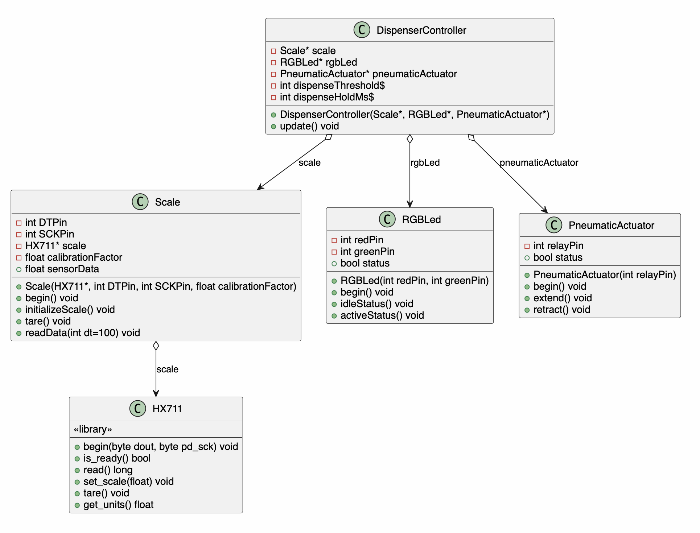

# Dispenser

Code for the first revision dispenser assembly.

A weight-triggered pneumatic dispenser built on an ESP32 (PlatformIO /
Arduino framework). An HX711 load cell drives the control loop: when the
measured weight crosses a threshold, `DispenserController` extends the
pneumatic piston, lights the indicator LED, and re-tares the scale.

## Architecture



The diagram source is [`diagrams/class-diagram.mmd`](diagrams/class-diagram.mmd)
(Mermaid). Regenerate the image after editing it with:

```sh
mmdc -i diagrams/class-diagram.mmd -o diagrams/class-diagram.png
```

## TODO — follow-ups

Best-practice cleanups identified during review but not yet applied
(tracked here rather than changed in code). Update the class diagram once
these land.

### Scale

- **Encapsulate the HX711.** Own it by value as a member instead of taking
  a non-owning `HX711*`. `Scale` is its only consumer, so the pointer also
  lets the global `HX711` and the sensor dependency leak into `main.cpp`.
- **Rename `initializeScale()` → `initialize()`** — the `Scale` suffix is
  redundant on a method of `Scale`.
- **`readData()` → `readGrams()` returning `float`.** Return the reading
  directly instead of writing it to a public field as a side effect.
- **Drop the public `sensorData` field** (bad name, and it's mutable public
  state only `DispenserController` reads — made redundant by `readGrams()`).
- **Remove the blocking `delay(100)` from the read path.** Baking a 100 ms
  delay into a getter couples loop timing into the data path; let the caller
  pace, or document why the settle delay belongs there.
- **Use a constructor member-initializer list** instead of assigning members
  in the body.
- **Add a timeout to the `while (!is_ready())` wait** in init so a
  disconnected/faulty load cell can't hang startup forever, and let init
  report success/failure instead of returning `void`.
- **Average multiple samples** for a stable reading (`get_units(times)`)
  rather than a single sample.
- **Explain or remove the throwaway `read()`** in init (its result is
  discarded — warm-up/flush?).
- **Consider merging `begin()` and `initialize()`** — they're always called
  back-to-back and nowhere else (Arduino convention is a single `begin()`).
- **Make member naming consistent** — `DTPin`/`SCKPin` vs `calibrationFactor`
  mix conventions.
- **Name the magic numbers** — the `1000 ms` poll interval and `100 ms`
  settle delay.
- **Document the unit assumption** — `get_units()` only returns grams if
  `calibrationFactor` is calibrated to grams.

### RGBLed (indicator)

- **Replace `idleStatus()` / `activeStatus()` with a single
  `setStatus(Status)`** taking an `enum class Status { Idle, Active }` (room
  for `Off` / `Error` later). One setter, and the state is named rather than
  implied by which method you call.
- **Replace the `bool status` field with the `Status` enum.** A bool can't
  represent the real state space (off / green / red), and the single-setter
  form structurally removes the current "both methods set `status`" bug — the
  field just gets assigned the argument.
- **Rename the class `RGBLed` → `IndicatorLed`.** It drives a two-colour
  (red/green) indicator, not a 3-channel RGB LED — and the instance is already
  called `indicatorLed`.
- **Move `pinMode()` out of the constructor into `begin()`** (same global
  static-init concern noted for the other classes).

### PneumaticActuator

(The self-assignment no-op, missing `status` update, constructor `pinMode`,
and boot-safe state are already fixed on the review branch, and the active-low
relay behaviour is now documented in code comments. Remaining:)

- **Replace or remove the `bool status` field.** It's vague and never read. If
  a position readback is useful, model it as `enum class Position { Retracted,
  Extended }` with an accessor; otherwise drop it. (`extend()` / `retract()`
  are already good action-verb names — no rename needed.)

### DispenserController

- **Move initialization onto the controller.** Add a `begin()` that brings the
  parts up in the right order (actuator to its safe state first, then LED, then
  `scale.begin()` + `initialize()`), so `setup()` just calls
  `controller.begin()` and doesn't need to know the sequence.
- **Drop the `Controller` suffix** → `Dispenser`. It's the top-level domain
  object; the suffix is redundant noise, especially once it owns its parts.
- **Own its parts instead of taking injected pointers.** The `Scale`,
  indicator LED, and actuator are used only by the controller, so it could
  compose them by value (built from a small pin/calibration config struct) and
  hide them from `main.cpp` — shrinking `main` to "declare config, call
  `begin()` / `update()`." Tradeoff: pin wiring moves out of `main` (Arduino's
  conventional home for it) into the config/constructor, and DI's testability
  benefit is theoretical here (no test harness; the parts aren't virtual). Same
  reasoning as the Scale/HX711 item — lean toward ownership for consistency.
- **Behavioural questions (from the review):** the per-trigger `tare()` can
  accumulate zero drift, and the loop is fully blocking (`readData`'s delay +
  the 150 ms hold) so the hold time is an open-loop guess rather than a measured
  dose.
